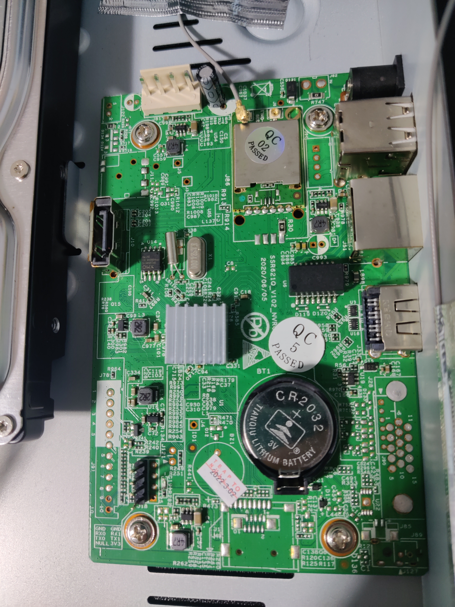

# ssr21q_v102_nvr04



This board can be found in some cheap surveillance camera NVRs such as [this one](https://www.dpin.de/nf/cheap-surveillance-cameras-nvr-hacking-to-work/) or [this one](https://support.nightowlsp.com/hc/en-us/articles/12716255551515-WNIP2-Series).

# Boot log

```
IPL g8e04b60
D-1f
HW Reset
miupll_233MHz
MIU0 zq=0x003a
miu_bw_set
utmi_1_init done
utmi_2_init done
utmi_3_init done
usbpll init done......
SPI 54M
clk_init done 
P1 USB_rterm trim=0x000d
P1 USB_HS_TX_CURRENT trim=0x0001
P2 USB_rterm trim=0x000d
P2 USB_HS_TX_CURRENT trim=0x000d
P3 USB_rterm trim=0x000d
P3 USB_HS_TX_CURRENT trim=0x000d
PM_vol_bgap trim=0x0004
GCR_SAR_DATA trim=0x0193
ETH 10T output swing trim=0x0010
ETH 100T output swing trim=0x0011
ETH RX input impedance trim=0x0000
ETH TX output impedance trim=0x0000
MIPI_HS_RTERM trim=0x0001
MIPI_LP_RTERM trim=0x0000
TX_current trimming trim[0x1A]=0x0048
TX_current trimming trim[0x1B]=0x004a
TX_current trimming trim[0x1C]=0x004a
HDMI2TX Rterm trim=0x001f
HDMI2TX_Ibias_CH0 trim=0x001c
HDMI2TX_Ibias_CH1 trim=0x001b
HDMI2TX_Ibias_CH2 trim=0x001a
HDMI2TX_Ibias_CH3 trim=0x001a
256MB
BIST0_0001-OK
Enable MMU and CACHE
Load IPL_CUST from NOR
offset:00010000
Unable to detect NOR
Load time 682 us, 25900 KiB/s
crc OK

IPL_CUST g8e04b60
MXP found at 0x00020000
runUBOOT()
runUBOOT()
[SPI_NOR]
 -Verify UBOOT CRC32 passed!
 -Decompress UBOOT XZ
  decomp_size=0x00081788
Disable MMU and D-cache before jump to UBOOT�

U-Boot 2015.01 (Aug 12 2020 - 10:21:49)

Version: I2g45a386a
I2C:   ready
DRAM:  
WARNING: Caches not enabled
gpio debug MHal_GPIO_Pad_Set: pin=44
gpio debug MHal_GPIO_Pad_Set: pin=17
gpio debug MHal_GPIO_Pad_Set: pin=18
gpio debug MHal_GPIO_Pad_Set: pin=39
nor_flash_mxp allocated success!!
Flash is detected (0x1003, 0x20, 0x70, 0x18)
SF: Detected nor0 with total size 16 MiB
MXP found at mxp_offset[3]=0x00020000, size=0x1000
env_offset=0x60000 env_size=0x10000
Flash is detected (0x1003, 0x20, 0x70, 0x18)
SF: Detected nor0 with total size 16 MiB
In:    serial
Out:   serial
Err:   serial
Net:   MAC Address 00:32:65:00:00:04
Auto-Negotiation...
AN failLink Status Speed:10 Full-duplex:0
Status Error!
sstar_emac
BootLogo IN(234f8eb0 40000), OUT(f700000, 800000), DISP(1280 1024 60), Interface:1
_BootLogoHdmitxCtrl 3258
Flash is detected (0x1003, 0x20, 0x70, 0x18)
SF: Detected nor0 with total size 16 MiB
SF: 2621440 bytes @ 0x70000 Read: OK
##  Booting kernel from Legacy Image at 22000000 ...
   Image Name:   MVX4##I2M#g45a386aKL_LX409##[BR:
   Image Type:   ARM Linux Kernel Image (lzma compressed)
   Data Size:    2608976 Bytes = 2.5 MiB
   Load Address: 20008000
   Entry Point:  20008000
   Verifying Checksum ... OK
-usb_stop(USB_PORT0)
-usb_stop(USB_PORT1)
-usb_stop(USB_PORT2)
   Uncompressing Kernel Image ... 
[XZ] !!!reserved 0x21000000 length=0x 1000000 for xz!!
   XZ: uncompressed size=0x51f000, ret=7
OK
atags:0x20000000

Starting kernel ...

Booting Linux on physical CPU 0x0
Linux version 4.9.84 (root@linux) (gcc version 4.9.4 (Buildroot 2017.08-gc7bbae9-dirty) ) #1 SMP PREEMPT Thu Jul 16 15:20:27 CST 2020
CPU: ARMv7 Processor [410fc075] revision 5 (ARMv7), cr=50c5387d
CPU: div instructions available: patching division code
CPU: PIPT / VIPT nonaliasing data cache, VIPT aliasing instruction cache
early_atags_to_fdt() success
OF: fdt:Machine model: INFINITY2M SSC010A-S01A-S
LXmem is 0xff00000 PHYS_OFFSET is 0x20000000
Add mem start 0x20000000 size 0xff00000!!!!

LX_MEM  = 0x20000000, 0xff00000
LX_MEM2 = 0x0, 0x0
LX_MEM3 = 0x0, 0x0
EMAC_LEN= 0x0
DRAM_LEN= 0x0
no any mmap reserved
deal_with_reserve_mma_heap memblock_reserve success mma_config[0].reserved_start=
0x24500000

deal_with_reserve_mma_heap memblock_reserve success mma_config[1].reserved_start=
0x2d000000

cma: Reserved 2 MiB at 0x2ce00000
Memory policy: Data cache writealloc
percpu: Embedded 14 pages/cpu @ccc1d000 s24920 r8192 d24232 u57344
Built 1 zonelists in Zone order, mobility grouping on.  Total pages: 37728
Kernel command line: console=ttyS0,115200 root=/dev/mtdblock3 rootfstype=squashfs ro init=/linuxrc LX_MEM=0xff00000 mma_heap=MMU_MMA,miu=0,sz=0x3B00000 mma_heap=mma_heap_name0,miu=0,sz=0x2F00000 mma_memblock_remove=1
PID hash table entries: 1024 (order: 0, 4096 bytes)
Dentry cache hash table entries: 32768 (order: 5, 131072 bytes)
Inode-cache hash table entries: 16384 (order: 4, 65536 bytes)
Memory: 143440K/152576K available (3098K kernel code, 279K rwdata, 1520K rodata, 180K init, 170K bss, 7088K reserved, 2048K cma-reserved)
Virtual kernel memory layout:
    vector  : 0xffff0000 - 0xffff1000   (   4 kB)
    fixmap  : 0xffc00000 - 0xfff00000   (3072 kB)
    vmalloc : 0xcd800000 - 0xff800000   ( 800 MB)
    lowmem  : 0xc0000000 - 0xcd000000   ( 208 MB)
    modules : 0xbf800000 - 0xc0000000   (   8 MB)
      .text : 0xc0008000 - 0xc030edb8   (3100 kB)
      .init : 0xc04b3000 - 0xc04e0000   ( 180 kB)
      .data : 0xc04e0000 - 0xc0525ff8   ( 280 kB)
       .bss : 0xc0527000 - 0xc0551b50   ( 171 kB)
SLUB: HWalign=64, Order=0-3, MinObjects=0, CPUs=2, Nodes=1
Preemptible hierarchical RCU implementation.
	Build-time adjustment of leaf fanout to 32.
	RCU restricting CPUs from NR_CPUS=4 to nr_cpu_ids=2.
RCU: Adjusting geometry for rcu_fanout_leaf=32, nr_cpu_ids=2
NR_IRQS:16 nr_irqs:16 16
ms_init_main_intc: np->name=ms_main_intc, parent=gic
ms_init_pm_intc: np->name=ms_pm_intc, parent=ms_main_intc
ss_init_gpi_intc: np->name=ms_gpi_intc, parent=ms_main_intc
Find CLK_cpupll_clk, hook ms_cpuclk_ops
arm_arch_timer: Architected cp15 timer(s) running at 6.00MHz (virt).
clocksource: arch_sys_counter: mask: 0xffffffffffffff max_cycles: 0x1623fa770, max_idle_ns: 440795202238 ns
sched_clock: 56 bits at 6MHz, resolution 166ns, wraps every 4398046511055ns
Switching to timer-based delay loop, resolution 166ns
Console: colour dummy device 80x30
console [ttyS0] enabled
Calibrating delay loop (skipped), value calculated using timer frequency.. 12.00 BogoMIPS (lpj=60000)
pid_max: default: 4096 minimum: 301
Mount-cache hash table entries: 1024 (order: 0, 4096 bytes)
Mountpoint-cache hash table entries: 1024 (order: 0, 4096 bytes)
CPU: Testing write buffer coherency: ok
CPU0: update cpu_capacity 1024
CPU0: thread -1, cpu 0, socket 0, mpidr 80000000
Setting up static identity map for 0x20008240 - 0x20008270
CPU1: update cpu_capacity 1024
CPU1: thread -1, cpu 1, socket 0, mpidr 80000001
Brought up 2 CPUs
SMP: Total of 2 processors activated (24.00 BogoMIPS).
CPU: All CPU(s) started in SVC mode.
devtmpfs: initialized
VFP support v0.3: implementor 41 architecture 2 part 30 variant 7 rev 5
clocksource: jiffies: mask: 0xffffffff max_cycles: 0xffffffff, max_idle_ns: 19112604462750000 ns
futex hash table entries: 16 (order: -2, 1024 bytes)
NET: Registered protocol family 16
DMA: preallocated 256 KiB pool for atomic coherent allocations


Version : MVX4##I2M#g45a386aKL_LX409##[BR:ssr621_20200522]#XVM

GPIO: probe end[ss_gpi_intc_domain_alloc] hw:42 -> v:45
[MS_PM_INTC] hw:20 -> v:53
hw-breakpoint: found 5 (+1 reserved) breakpoint and 4 watchpoint registers.
hw-breakpoint: maximum watchpoint size is 8 bytes.
SCSI subsystem initialized
usbcore: registered new interface driver usbfs
usbcore: registered new interface driver hub
usbcore: registered new device driver usb
clocksource: Switched to clocksource arch_sys_counter
NET: Registered protocol family 2
TCP established hash table entries: 2048 (order: 1, 8192 bytes)
TCP bind hash table entries: 2048 (order: 3, 40960 bytes)
TCP: Hash tables configured (established 2048 bind 2048)
UDP hash table entries: 128 (order: 0, 6144 bytes)
UDP-Lite hash table entries: 128 (order: 0, 6144 bytes)
NET: Registered protocol family 1
RPC: Registered named UNIX socket transport module.
RPC: Registered udp transport module.
RPC: Registered tcp transport module.
RPC: Registered tcp NFSv4.1 backchannel transport module.
hw perfevents: enabled with armv7_cortex_a7 PMU driver, 5 counters available
workingset: timestamp_bits=30 max_order=16 bucket_order=0
squashfs: version 4.0 (2009/01/31) Phillip Lougher
jffs2: version 2.2. � 2001-2006 Red Hat, Inc.
io scheduler noop registered
io scheduler deadline registered (default)
libphy: Fixed MDIO Bus: probed
PPP generic driver version 2.4.2
PPP BSD Compression module registered
PPP Deflate Compression module registered
PPP MPPE Compression module registered
NET: Registered protocol family 24
ehci_hcd: USB 2.0 'Enhanced' Host Controller (EHCI) Driver
Mstar_ehc_init version:20180309
Sstar-ehci-2 H.W init
CHIP_FUNCTION SET. ID=4, param=65537
Titania3_series_start_ehc start
[USB] config miu select [70] [e8] [ef] [ef]
[USB] enable miu lower bound address subtraction
[USB] init squelch level 0x2
[USB] no platform_data, device tree coming
[USB][EHC] dma coherent_mask 0xffffffffffffffff mask 0xffffffffffffffff
BC disable 
[USB] soc:Sstar-ehci-2 irq --> 40
Sstar-ehci-2 soc:Sstar-ehci-2: EHCI Host Controller
Sstar-ehci-2 soc:Sstar-ehci-2: new USB bus registered, assigned bus number 1
Sstar-ehci-2 soc:Sstar-ehci-2: irq 40, io mem 0xfd285000
usb usb1: New USB device found, idVendor=1d6b, idProduct=0002
usb usb1: New USB device strings: Mfr=3, Product=2, SerialNumber=1
usb usb1: Product: EHCI Host Controller
usb usb1: Manufacturer: Linux 4.9.84 ehci_hcd
usb usb1: SerialNumber: mstar
hub 1-0:1.0: USB hub found
hub 1-0:1.0: 1 port detected
Sstar-ehci-1 H.W init
CHIP_FUNCTION SET. ID=4, param=1
Titania3_series_start_ehc start
[USB] config miu select [70] [e8] [ef] [ef]
[USB] enable miu lower bound address subtraction
[USB] init squelch level 0x2
[USB] no platform_data, device tree coming
[USB][EHC] dma coherent_mask 0xffffffffffffffff mask 0xffffffffffffffff
BC disable 
[USB] soc:Sstar-ehci-1 irq --> 39
Sstar-ehci-1 soc:Sstar-ehci-1: EHCI Host Controller
Sstar-ehci-1 soc:Sstar-ehci-1: new USB bus registered, assigned bus number 2
Sstar-ehci-1 soc:Sstar-ehci-1: irq 39, io mem 0xfd284800
usb usb2: New USB device found, idVendor=1d6b, idProduct=0002
usb usb2: New USB device strings: Mfr=3, Product=2, SerialNumber=1
usb usb2: Product: EHCI Host Controller
usb usb2: Manufacturer: Linux 4.9.84 ehci_hcd
usb usb2: SerialNumber: mstar
hub 2-0:1.0: USB hub found
hub 2-0:1.0: 1 port detected
Sstar-ehci-3 H.W init
CHIP_FUNCTION SET. ID=4, param=131073
Titania3_series_start_ehc start
[USB] config miu select [70] [e8] [ef] [ef]
[USB] enable miu lower bound address subtraction
[USB] init squelch level 0x2
[USB] no platform_data, device tree coming
[USB][EHC] dma coherent_mask 0xffffffffffffffff mask 0xffffffffffffffff
BC disable 
[USB] soc:Sstar-ehci-3 irq --> 57
Sstar-ehci-3 soc:Sstar-ehci-3: EHCI Host Controller
Sstar-ehci-3 soc:Sstar-ehci-3: new USB bus registered, assigned bus number 3
Sstar-ehci-3 soc:Sstar-ehci-3: irq 57, io mem 0xfd286400
usb usb3: New USB device found, idVendor=1d6b, idProduct=0002
usb usb3: New USB device strings: Mfr=3, Product=2, SerialNumber=1
usb usb3: Product: EHCI Host Controller
usb usb3: Manufacturer: Linux 4.9.84 ehci_hcd
usb usb3: SerialNumber: mstar
hub 3-0:1.0: USB hub found
hub 3-0:1.0: 1 port detected
usbcore: registered new interface driver cdc_wdm
usbcore: registered new interface driver usb-storage
mousedev: PS/2 mouse device common for all mice
==20180309==> hub_port_init 1 #0
Plug in USB Port2
i2c /dev entries driver
usbcore: registered new interface driver usbhid
usbhid: USB HID core driver
1f221000.uart0: ttyS0 at MMIO 0x0 (irq = 31, base_baud = 10800000) is a unknown
1f221200.uart1: ttyS1 at MMIO 0x0 (irq = 32, base_baud = 10800000) is a unknown
1f220400.uart2: ttyS2 at MMIO 0x0 (irq = 34, base_baud = 10800000) is a unknown
1f221400.uart2: ttyS3 at MMIO 0x0 (irq = 35, base_baud = 10800000) is a unknown
[Core Voltage] check_voltage_valid: Not support 0mV, use 850mV
MSYS: DMEM request: [emac0_buff]:0x00000812
MSYS: DMEM request: [emac0_buff]:0x00000812 success, CPU phy:@0x2CE4D000, virt:@0xCCE4D000
libphy: mdio: probed
mdio_bus mdio-bus@emac0: /soc/emac0/mdio-bus@emac0/ethernet-phy@0 has invalid PHY address
mdio_bus mdio-bus@emac0: scan phy ethernet-phy at address 0
mdio_bus mdio-bus@emac0: scan phy ethernet-phy at address 1
mdio_bus mdio-bus@emac0: scan phy ethernet-phy at address 2
mdio_bus mdio-bus@emac0: scan phy ethernet-phy at address 3
mdio_bus mdio-bus@emac0: scan phy ethernet-phy at address 4
mdio_bus mdio-bus@emac0: scan phy ethernet-phy at address 5
mdio_bus mdio-bus@emac0: scan phy ethernet-phy at address 6
mdio_bus mdio-bus@emac0: scan phy ethernet-phy at address 7
mdio_bus mdio-bus@emac0: scan phy ethernet-phy at address 8
mdio_bus mdio-bus@emac0: scan phy ethernet-phy at address 9
mdio_bus mdio-bus@emac0: scan phy ethernet-phy at address 10
mdio_bus mdio-bus@emac0: scan phy ethernet-phy at address 11
mdio_bus mdio-bus@emac0: scan phy ethernet-phy at address 12
mdio_bus mdio-bus@emac0: scan phy ethernet-phy at address 13
mdio_bus mdio-bus@emac0: scan phy ethernet-phy at address 14
mdio_bus mdio-bus@emac0: scan phy ethernet-phy at address 15
mdio_bus mdio-bus@emac0: scan phy ethernet-phy at address 16
mdio_bus mdio-bus@emac0: scan phy ethernet-phy at address 17
mdio_bus mdio-bus@emac0: scan phy ethernet-phy at address 18
mdio_bus mdio-bus@emac0: scan phy ethernet-phy at address 19
mdio_bus mdio-bus@emac0: scan phy ethernet-phy at address 20
usb 1-1: new high-speed USB device number 2 using Sstar-ehci-2
mdio_bus mdio-bus@emac0: scan phy ethernet-phy at address 21
mdio_bus mdio-bus@emac0: scan phy ethernet-phy at address 22
mdio_bus mdio-bus@emac0: scan phy ethernet-phy at address 23
mdio_bus mdio-bus@emac0: scan phy ethernet-phy at address 24
mdio_bus mdio-bus@emac0: scan phy ethernet-phy at address 25
mdio_bus mdio-bus@emac0: scan phy ethernet-phy at address 26
mdio_bus mdio-bus@emac0: scan phy ethernet-phy at address 27
mdio_bus mdio-bus@emac0: scan phy ethernet-phy at address 28
mdio_bus mdio-bus@emac0: scan phy ethernet-phy at address 29
mdio_bus mdio-bus@emac0: scan phy ethernet-phy at address 30
mdio_bus mdio-bus@emac0: scan phy ethernet-phy at address 31
[emac_phy_connect][3169] connected mac emac0 to PHY at mdio-bus@emac0:00 [uid=11112222, driver=SStar 10/100 Ethernet Phy]
MSYS: DMEM request: [emac1_buff]:0x00062812
MSYS: DMEM request: [emac1_buff]:0x00062812 success, CPU phy:@0x2CE50000, virt:@0xCCE50000
libphy: mdio: probed
mdio_bus mdio-bus@emac1: /soc/emac1/mdio-bus@emac1/ethernet-phy@1 has invalid PHY address
mdio_bus mdio-bus@emac1: scan phy ethernet-phy at address 0
mdio_bus mdio-bus@emac1: scan phy ethernet-phy at address 1
mdio_bus mdio-bus@emac1: scan phy ethernet-phy at address 2
mdio_bus mdio-bus@emac1: scan phy ethernet-phy at address 3
mdio_bus mdio-bus@emac1: scan phy ethernet-phy at address 4
mdio_bus mdio-bus@emac1: scan phy ethernet-phy at address 5
mdio_bus mdio-bus@emac1: scan phy ethernet-phy at address 6
mdio_bus mdio-bus@emac1: scan phy ethernet-phy at address 7
mdio_bus mdio-bus@emac1: scan phy ethernet-phy at address 8
mdio_bus mdio-bus@emac1: scan phy ethernet-phy at address 9
mdio_bus mdio-bus@emac1: scan phy ethernet-phy at address 10
mdio_bus mdio-bus@emac1: scan phy ethernet-phy at address 11
mdio_bus mdio-bus@emac1: scan phy ethernet-phy at address 12
mdio_bus mdio-bus@emac1: scan phy ethernet-phy at address 13
mdio_bus mdio-bus@emac1: scan phy ethernet-phy at address 14
mdio_bus mdio-bus@emac1: scan phy ethernet-phy at address 15
mdio_bus mdio-bus@emac1: scan phy ethernet-phy at address 16
mdio_bus mdio-bus@emac1: scan phy ethernet-phy at address 17
mdio_bus mdio-bus@emac1: scan phy ethernet-phy at address 18
mdio_bus mdio-bus@emac1: scan phy ethernet-phy at address 19
mdio_bus mdio-bus@emac1: scan phy ethernet-phy at address 20
mdio_bus mdio-bus@emac1: scan phy ethernet-phy at address 21
mdio_bus mdio-bus@emac1: scan phy ethernet-phy at address 22
mdio_bus mdio-bus@emac1: scan phy ethernet-phy at address 23
mdio_bus mdio-bus@emac1: scan phy ethernet-phy at address 24
mdio_bus mdio-bus@emac1: scan phy ethernet-phy at address 25
mdio_bus mdio-bus@emac1: scan phy ethernet-phy at address 26
mdio_bus mdio-bus@emac1: scan phy ethernet-phy at address 27
mdio_bus mdio-bus@emac1: scan phy ethernet-phy at address 28
mdio_bus mdio-bus@emac1: scan phy ethernet-phy at address 29
mdio_bus mdio-bus@emac1: scan phy ethernet-phy at address 30
mdio_bus mdio-bus@emac1: scan phy ethernet-phy at address 31
[emac_phy_connect][3169] connected mac emac1 to PHY at mdio-bus@emac1:00 [uid=00000000, driver=Generic PHY]
usb 1-1: New USB device found, idVendor=0bda, idProduct=f192
usb 1-1: New USB device strings: Mfr=1, Product=2, SerialNumber=3
Registered IR keymap rc-mstar-dtv
input: mstar ir as /devices/virtual/rc/rc0/input0
rc rc0: mstar ir as /devices/virtual/rc/rc0
usb 1-1: Product: 802.11n  WLAN Adapter
usb 1-1: Manufacturer: Realtek
usb 1-1: SerialNumber: 00e04c000001
ms_rtcpwc 1f006800.rtcpwc: rtc core: registered 1f006800.rtcpwc as rtc0
MSYS: DMEM request: [BDMA_FSP_WBUFF]:0x00010040
MSYS: DMEM request: [BDMA_FSP_WBUFF]:0x00010040 success, CPU phy:@0x2CEC0000, virt:@0xCCEC0000
[Ser flash] phys=0x2cec0000, virt=0xccec0000, bus=0x0cec0000 len:0x10040
[FSP] Flash is detected (0x1003, 0x20, 0x70, 0x18) ver1.1
[FSP] 1-1-4 QUAD_READ MODE
mtd .name = NOR_FLASH, .size = 0x01000000 (16MiB)
 .erasesize = 0x00010000 .numeraseregions = 0
MXP_PARTS!!
MXP found at mxp_offset[3]=0x00020000, size=0x1000
Creating 9 MTD partitions on "NOR_FLASH":
0x000000000000-0x000000060000 : "BOOT"
0x000000060000-0x000000070000 : "UBOOT_ENV"
0x000000070000-0x0000002f0000 : "KERNEL"
0x0000002f0000-0x0000003f0000 : "ROOTFS"
0x0000003f0000-0x000000ef0000 : "APP"
0x000000ef0000-0x000000f30000 : "LOGO"
0x000000f30000-0x000000fe0000 : "CONFIG"
0x000000fe0000-0x000000ff0000 : "ODM"
0x000000ff0000-0x000001000000 : "ID"
[ms_cpufreq_init] Current clk=998244352
[ahci_sstar_probe] , priv->res_ahci_port0 =0xfd345100 
[ahci_sstar_probe] , priv->res_ahci_misc =0xfd2a4a00 
[SATA] phy_mode =0
SATA_TX_R50 trim=0x000F
SATA_RX_R50 trim=0x000F
SATA_TX_R50_IBIAS trim=0x0019
SATA_RXPLL_ICTRL_CDR trim=0x0003
[SATA0] Clock : ON
sstar sata HW settings done!!!
[SATA] phy_mode =0
ahci_sstar 1f345000.sata: AHCI 0001.0300 32 slots 1 ports 6 Gbps 0x1 impl platform mode
ahci_sstar 1f345000.sata: flags: ncq sntf pm led clo only pmp fbs pio slum part ccc apst 
ahci_sstar 1f345000.sata: port 0 is not capable of FBS
scsi host0: ahci_sstar
ata1: SATA max UDMA/133 mmio [mem 0x1f345000-0x1f3450ff] port 0x100 irq 51
[ahci_sstar_probe] , SSTAR AHCI SATA registered 
Initializing XFRM netlink socket
NET: Registered protocol family 17
NET: Registered protocol family 15
8021q: 802.1Q VLAN Support v1.8
sctp: Hash tables configured (bind 128/204)
ThumbEE CPU extension supported.
Registering SWP/SWPB emulation handler
ms_rtcpwc 1f006800.rtcpwc: setting system clock to 2023-09-20 03:10:38 UTC (1695179438)
OF: fdt:not creating '/sys/firmware/fdt': CRC check failed
ata1: SATA link down (SStatus 0 SControl 300)
VFS: Mounted root (squashfs filesystem) readonly on device 31:3.
devtmpfs: mounted
This architecture does not have kernel memory protection.
random: linuxrc: uninitialized urandom read (4 bytes read)
random: sh: uninitialized urandom read (4 bytes read)
random: mount: uninitialized urandom read (4 bytes read)
random: S00devs: uninitialized urandom read (4 bytes read)
random: mknod: uninitialized urandom read (4 bytes read)
random: mknod: uninitialized urandom read (4 bytes read)
random: mknod: uninitialized urandom read (4 bytes read)
random: S01udev: uninitialized urandom read (4 bytes read)
random: mkdir: uninitialized urandom read (4 bytes read)
random: mount: uninitialized urandom read (4 bytes read)
upgrade version: Aug  1 2020 17:10:48
mount dir('/media/usb1') isn't exist now!
check sda...
sda... not found
check sdb...
sdb... not found
check sdc...
sdc... not found
check sdd...
sdd... not found
check sde...
sde... not found
check sdf...
sdf... not found
check sdg...
sdg... not found
check sdh...
sdh... not found
check sdi...
sdi... not found
check sdj...
sdj... not found
check sdk...
sdk... not found
check sdl...
sdl... not found
enable log not found.
enable log2 not found.
163840
163840
1514
mhal: loading out-of-tree module taints kernel.
mhal: module license 'PROPRIETARY' taints kernel.
Disabling lock debugging due to kernel taint
mhal driver init
jpe driver probed
module [sys] init
MI_SYSCFG_SetupMmapLoader default_config_path:/config/config_tool, argv1:/config/load_mmap,argv2:/config/mmap.ini
Function = init_glob_miu_kranges, Line = 603, Insert KProtect for LX @ MIU: 0
Function = init_glob_miu_kranges, Line = 612, [INIT] for LX0 kprotect: from 0x20000000 to 0x2FF00000, using block 0
config...... strPath:/config/config_tool, argv0:/config/load_config
function:parese_Cmdline,pCmd_Section:0xff00000
MM
U_
MM
A    miu=0,sz=3b00000  reserved_start=24500000
r_front->miuBlockIndex:0,r_front->start_cpu_bus_pa:0x20000000,r_front->start_cpu_bus_pa+r_front->length:0x24500000
r_back->miuBlockIndex:1,r_back->start_cpu_bus_pa:0x28000000,r_back->start_cpu_bus_pa+r_back->length:0x2ff00000
mi_sys_mma_allocator_create success, heap_base_addr=24500000 length=3b00000 
mm
a_
he
ap
_n
am
e0
    miu=0,sz=2f00000  reserved_start=2d000000
r_front->miuBlockIndex:1,r_front->start_cpu_bus_pa:0x28000000,r_front->start_cpu_bus_pa+r_front->length:0x2d000000
mi_sys_mma_allocator_create success, heap_base_addr=2d000000 length=2f00000 
Kernel CONFIG_HZ = 100
Sigmastar Module version: project_commit.8456c3c sdk_commit.ec18ae1 build_time.20200707145953
module [ai] init
module [ao] init
module [gfx] init
module [divp] init
module [disp] init
module [hdmi] init
module [vdec] init
module [vdisp] init
module [venc] init Jul  7 2020 15:00:16
[GOP]HalGopUpdateGwinParam 718: GOP_id=011 not support
[GOP]HalGopSetArgb1555Alpha 1203: GOPId=0x11 not support
[GOP]HalGopSetArgb1555Alpha 1203: GOPId=0x11 not support
insert juan mod
bridge: filtering via arp/ip/ip6tables is no longer available by default. Update your scripts to load br_netfilter if you need this.
Ebtables v2.0 registered
sh: bad number
daemon server build:Apr 15 2020, 17:10:08  net port:8925
Active thread listen in port:9025
nCreate idx = 1 1
nCreate idx = 0 0
[ error] [0.022s] FLASH: [odm_read_all: 683] ODM OPEN /dev/mtdblock7 ...
[  info] [0.059s] APP: [NK_PRODUCT_Init: 842] BuildData3
[  info] [0.060s] APP: [NK_PRODUCT_Init: 844] BuildData Done3
play_cam = 4
MAX_CAM:10 max_bnc_cam:0 play_cam=4
```

# Breaking the device
I unplugged this device at 99% complete during an OTA upgrade which caused UBoot unable to load Linux

```
Wrong Image Format for bootm command
ERROR: can't get kernel image!
```

## Saving the device

The U-Boot console can be accessed ovar UART by holding down the Return/Enter key during boot.

### printenv

```
SigmaStar # printenv

UpgradeImage=SigmastarUpgrade.bin
baudrate=115200
bootargs=console=ttyS0,115200 root=/dev/mtdblock3 rootfstype=squashfs ro init=/linuxrc LX_MEM=0xff00000 mma_heap=MMU_MMA,miu=0,sz=0x3B00000 mma_heap=mma_heap_name0,miu=0,sz=0x2F00000 mma_memblock_remove=1
bootcmd=${s10};${s11};${s12};${s13};
bootdelay=0
bootm_failed=1
cpu_part_start=1425e000
ethact=sstar_emac
ethaddr=00:32:65:00:00:04
fileaddr=235cc190
filesize=143
ipaddr=192.168.1.114
netmask=255.255.0.0
s10=bootlogo
s11=sf probe 0
s12=sf read 0x22000000 0x70000 0x280000
s13=bootm 0x22000000
s21=bzr 200 1
s22=bzr 55 2
s23=usb start 2
s24=fatload usb 0 0x22000000 help.rom
s41=bzr 55 2
s42=bzr 500 1
s43=bzr 500 4
s44=reset
serverip=192.168.1.1
sf_kernel_size=280000
sf_kernel_start=70000
sf_part_size=40000
sf_part_start=ef0000
stderr=serial
stdin=serial
stdout=serial
usb_folder=images

Environment size: 913/4092 bytes
```

## Figuring out what's fucked up

Probe the SPI
```
sf probe 0
```

Dump the SPI to a .bin file on TFTP server
```
sfbin 0x22000000 0x00 <ip>:<filename>
```

Examine the dump. looking for Kernel
```
binwalk <filename>
```

```
DECIMAL       HEXADECIMAL     DESCRIPTION                                                                                                                                                    

---------------------------------------------------------------------------
81051         0x13C9B         xz compressed data                                81428         0x13E14         CRC32 polynomial table, little endian             196608        0x30000         uImage header, header size: 64 bytes, header CRC: 0x529EA62C, created: 2020-08-12 02:22:22, image size: 190092 bytes, Data Address: 0x0, Entry Point: 0x0, data CRC: 0xB254D69A, OS: Firmware, CPU: ARM, image type: OS Kernel Image, compression type: lzma, image name: "MVX4##I2M#g45a386aCM_UBT1501#XVM"                                               196672        0x30040         xz compressed data                                3080192       0x2F0000        Squashfs filesystem, little endian, version 4.0, compression:xz, size: 844888 bytes, 309 inodes, blocksize: 131072 bytes, created: 2023-06-28 06:57:24
4128768       0x3F0000        Squashfs filesystem, little endian, version 4.0, compression:xz, size: 10632832 bytes, 846 inodes, blocksize: 65536 bytes, created: 2023-06-28 06:57:28
14825212      0xE236FC        xz compressed data
```

So, we found the kernel at offset `0x30000`

Now back to the device, we will reboot and test bootm with the newly discovered offset/address

```
sf probe 0
```

```
sf read 0x22000000 0x30000 0x280000
```

```
bootm 0x22000000 
```


It worked!

![[it_worked.png]]

But not really

The real way to fix this is to load the latest firmware.rom onto a USB drive, name it `help.rom` and then run `${s23};${s24}` -- which runs the firmware upgrade from the USB port :)

# Brute Forcing

After dumping the firmware, I realized I had....well...the firmware. I used binwalk to extract the contents of the filesystem and found some password hashes. I started attacking the hashes with hashcat mask attacks.

```
?l?u?d for 1-4 chars
?l for 5+ chars
```

![[hashcat.png]]

Creds
```
stb:stb
root:zlxx.
```

Next step: dump the squashfs filesystem(s) and see what's hanging around in there.

Now, get root -- in the UBoot shell enter
```
set bootargs console=ttyS0,115200 root=/dev/mtdblock3 rootfstype=squashfs ro init=/linuxrc && /bin/busybox LX_MEM=0xff00000 mma_heap=MMU_MMA,miu=0,sz=0x3B00000 mma_heap=mma_heap_name0,miu=0,sz=0x2F00000 mma_memblock_remove=1
```

Then 
```
${s10};${s11};${s12};${s13}
```

That didn't work...

# Boot sequence

## IPL

## SPL (UBoot by SigmaStar/MStar)
```sh
# Set boot args
bootargs=console=ttyS0,115200 root=/dev/mtdblock3 rootfstype=squashfs ro init=/linuxrc LX_MEM=0xff00000 mma_heap=MMU_MMA,miu=0,sz=0x3B00000 mma_heap=mma_heap_name0,miu=0,sz=0x2F00000 mma_memblock_remove=1

# Start boot
bootlogo; sf probe 0; sf read 0x22000000 0x70000 0x280000; bootm 0x22000000;
```

## Linux Kernel
```sh
mount /dev/mtdblock3
/liniuxrc
```

### Linuxrc
```sh
/bin/bash
```

### init.d/rcS
```sh
#! /bin/sh
/bin/mount -a

for initscript in /etc/init.d/S[0-9][0-9]*
do
        if [ -x $initscript ] ;
        then
                $initscript
        fi
done
```


### initscritpt(s) in /etc/init.d

#### S00devs
```sh
#!/bin/sh

if [ ! -e /dev/console ] ; then  
	mknod /dev/console c 5 1
fi

if [ ! -e /dev/ttyAMA0 ] ; then  
	mknod /dev/ttyAMA0 c 204 64
fi

if [ ! -e /dev/ttyAMA1 ] ; then  
	mknod /dev/ttyAMA1 c 204 65
fi

if [ ! -e /dev/ttyS000 ] ; then  
	mknod /dev/ttyS000 c 204 64
fi

if [ ! -e /dev/null ] ; then  
	mknod /dev/null c 1 3
fi

if [ ! -e /dev/zero ] ; then  
	mknod /dev/zero c 1 5
fi
```

#### S01udevs
```sh
#!/bin/sh

mkdir /dev/pts
mount -t devpts devpts /dev/pts
/bin/echo "/sbin/mdev" > /proc/sys/kernel/hotplug
/sbin/mdev -s

#udevd --daemon

#udevtrigger
```

#### S02pppd
```sh
#!/bin/sh
mkdir /tmp/run
mkdir /tmp/lock
mount --binding /tmp/run  /var/run
mount --binding /tmp/lock /var/lock
```

#### S03pppoe
```sh
#!/bin/sh
#echo "PPPoE config"
#cp /etc/ppp/chap-secrets-bk /tmp/chap-secrets
#cp /etc/ppp/pap-secrets-bk /tmp/pap-secrets
#cp /etc/ppp/pppoe.conf-bk /tmp/pppoe.conf
#cp /etc/ppp/chap-secrets-bk /tmp/chap-secrets-bak
#cp /etc/ppp/pap-secrets-bk /tmp/pap-secrets-bak
#cp /etc/ppp/pppoe.conf-bk /tmp/pppoe.conf-bak
```

#### S80network
```sh
#!/bin/sh
ipaddr=
bootp=
gateway=
netmask=
hostname=
netdev=
autoconf=

ifconfig lo 127.0.0.1 up
ifconfig eth0 up
route add -net 127.0.0.0 netmask 255.0.0.0 lo
for ipinfo in `cat /proc/cmdline`
do
        case "$ipinfo" in
        ip=*)
                for var in  ipaddr bootp gateway netmask hostname netdev autoconf
                do
                        eval read $var
                done << EOF
                `echo "$ipinfo" | sed "s/:/\n/g" | sed "s/^[    ]*$/-/g"`
EOF
                ipaddr=`echo "$ipaddr" | cut -d = -f 2`
                [ x$ipaddr == x ] && ipaddr=x
                ;;
        esac
done
[ -z "$ipaddr" ] && exit 0

echo "      IP: $ipaddr"
echo "   BOOTP: $bootp"
echo " GATEWAY: $gateway"
echo " NETMASK: $netmask"
echo "HOSTNAME: $hostname"
echo "  NETDEV: $netdev"
echo "AUTOCONF: $autoconf"

if [ x$ipaddr == x- ] ; then
        # use DHCP
        :
else
        cmd="ifconfig $netdev $ipaddr"
        [ x$netmask != x- ] && cmd="$cmd netmask $netmask"
        eval $cmd
        [ x$gateway != x- ] && route add default gw $gateway
fi
```

#### S99
```sh
#! /bin/sh

HOME=/
PATH=/sbin:/bin:/usr/sbin:/usr/bin:/opt/bin:/opt/sbin:/opt/module/hi_tools
runlevel=S
prevlevel=N
umask 022
export PATH runlevel prevlevel
export LD_LIBRARY_PATH="/usr/local/lib:/usr/lib:/lib:/opt/lib"

# Stop tty  from doing XOFF/XON with Ctrl-S/Ctrl-Q, Modify Ctrl-D/C/\/U/Z/R/W/V/O to undef

stty ixany;
stty ixoff -ixon;
stty eof undef;
stty intr undef;
stty quit undef;
stty kill undef;
stty susp undef;
stty rprnt undef;
stty werase undef;
stty lnext undef;
stty flush undef

/bin/mount -a
#/bin/echo /sbin/mdev > /proc/sys/kernel/hotplug
#/sbin/mdev -s
/bin/upgrade & 
mount -t squashfs /dev/mtdblock4 /opt
#export PATH
#export LD_LIBRARY_PATH
cd /opt
sh run_app.sh
```

Interesting spots to look for vulns:
- maybe we can skip right to `run_app.sh` before the tty is killed
- maybe we can alias `stty` to prevent tty from being killed
- maybe `/bin/upgrade` checks local storage?
- 
### Tell init what to do to dump `run_app.sh`
```sh
/bin/mount -a,/etc/init.d/S00devs,/etc/init.d/S01udev,/etc/init.d/S02pppd,/etc/init.d/S03pppoe,/etc/init.d/S80network,mount -t squashfs /dev/mtdblock4 /opt,cat /opt/run_app.sh
```

```sh
# Set boot args
set bootargs console=ttyS0,115200 root=/dev/mtdblock3 rootfstype=squashfs ro init=/bin/mount -a,/etc/init.d/S00devs,/etc/init.d/S01udev,/etc/init.d/S02pppd,/etc/init.d/S03pppoe,/etc/init.d/S80network,mount -t squashfs /dev/mtdblock4 /opt,cat /opt/run_app.sh LX_MEM=0xff00000 mma_heap=MMU_MMA,miu=0,sz=0x3B00000 mma_heap=mma_heap_name0,miu=0,sz=0x2F00000 mma_memblock_remove=1

# Start boot
bootlogo; sf probe 0; sf read 0x22000000 0x70000 0x280000; bootm 0x22000000;
```

### Run `run_app.sh` instead of init.d scripts

```sh
# Set boot args
set bootargs console=ttyS0,115200 root=/dev/mtdblock3 rootfstype=squashfs ro init=/bin/cat run_app.sh LX_MEM=0xff00000 mma_heap=MMU_MMA,miu=0,sz=0x3B00000 mma_heap=mma_heap_name0,miu=0,sz=0x2F00000 mma_memblock_remove=1

# Start boot
bootlogo; sf probe 0; sf read 0x22000000 0x70000 0x280000; bootm 0x22000000;
```

### Alias `stty` to prevent killing input/output.

```sh
# Set boot args
set bootargs console=ttyS0,115200 root=/dev/mtdblock3 rootfstype=squashfs ro init=/bin/alias stty=echo && /linuxrc LX_MEM=0xff00000 mma_heap=MMU_MMA,miu=0,sz=0x3B00000 mma_heap=mma_heap_name0,miu=0,sz=0x2F00000 mma_memblock_remove=1

# Start boot
bootlogo; sf probe 0; sf read 0x22000000 0x70000 0x280000; bootm 0x22000000;
```

ACTUALLY just follow this guide
https://gist.github.com/aSmig/e50058a54ab85428915521f233ffa3d0

But it didn't work at first, so I used the UBoot command line to only dump the app partition and beyond. Then `binwalk` was able to properly dump the squashfs -- previously it was unable to do so bc of some corruption.

![[minor_diff_in_app_run.png]]

Make the appropriate adjustments to the script(s) and we have ROOT SHELL whenever the USB drive is plugged in during boot!


